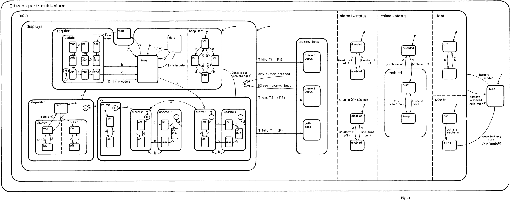

# Citizen Quartz Multi Alarm III

A pretty exact replica of the Citizen Quartz Multi Alarm III watch based on figure 31 in David Harel’s 1987 paper introducing statecharts.




## Links

[Statecharts: a visual formalism for complex systems](https://www.sciencedirect.com/science/article/pii/0167642387900359)

Awesome overall intro to statecharts: [https://statecharts.github.io/](https://statecharts.github.io/)

[XState](https://xstate.js.org), a JavaScript framework that implements statecharts

[More about the watch](https://whichwatchtoday.blogspot.com/2013/02/citizen-quartz-multi-alarm-iii-41-3534.html)

# Usage

Built with [Create React App](https://github.com/facebook/create-react-app). See their documentation for details.

Clone this repo on your machine, navigate to the project directory, then run:

```
yarn install
yarn start
```

`yarn start` runs the app in the development mode.\
Open [http://localhost:3000](http://localhost:3000) to view it in the browser.

The page will reload if you make edits.\
You will also see any lint errors in the console.

## Learn More

To learn React, check out the [React documentation](https://reactjs.org/).

# Deployment

Tweak the `homepage` field in `package.json` if you’re going to deploy to GitHub Pages.

More about deploying Create React App apps: [https://create-react-app.dev/docs/deployment/#github-pages](https://create-react-app.dev/docs/deployment/#github-pages)
